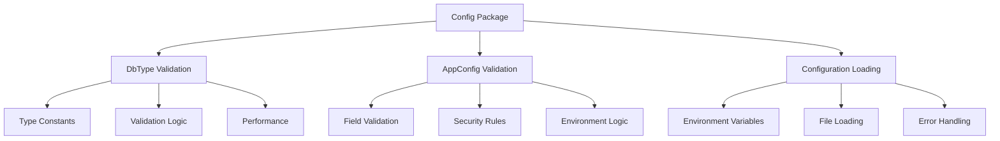

# Config Package Test Suite

## Overview

This comprehensive test suite ensures the robustness, security, and reliability of the application's configuration management system. The test suite is divided into three main components that work together to validate configuration loading, database type validation, and application-level configuration validation.

## Why This Testing Strategy?

### Critical Configuration Management
Configuration errors are among the most common causes of production failures. This test suite addresses:

- **Runtime Failures**: Invalid configurations that cause application crashes
- **Security Vulnerabilities**: Weak secrets, improper database connections, exposed credentials
- **Performance Issues**: Inefficient validation logic, resource leaks
- **Maintenance Problems**: Configuration drift, undocumented dependencies

### Defense in Depth Testing
The three-tier testing approach provides comprehensive coverage:

1. **Type-Level Validation** (`DbType` tests) - Ensures database type constants and validation are correct
2. **Configuration-Level Validation** (`AppConfig.Validate()` tests) - Validates complete configuration objects
3. **System-Level Integration** (`LoadConfig()` tests) - Tests real-world configuration loading scenarios

## Test Suite Architecture

### Component Overview



### Testing Philosophy

#### **Fail Fast, Fail Clearly**
- Configuration errors are detected at startup, not runtime
- Clear error messages guide developers to fixes
- Validation prevents invalid states from propagating

#### **Security by Default**
- Production environments enforce strong security requirements
- Secrets are properly masked in logs
- Invalid configurations are rejected, not ignored

#### **Performance Conscious**
- Validation operations complete in microseconds
- No unnecessary allocations during validation
- Benchmarking prevents performance regressions

## Component 1: DbType Validation Tests

### Purpose and Justification

Database type validation is the foundation of configuration security. Invalid database types can lead to:
- Runtime panics when database connections fail
- Security issues with unsupported database drivers
- Configuration confusion during deployment

### Test Categories

| Test Category | Purpose | Justification |
|---------------|---------|---------------|
| **Basic Validation** | Ensure supported types pass, invalid types fail | Prevents runtime database connection failures |
| **Coverage Testing** | All constants are properly validated | Catches development workflow issues when new types are added |
| **Security Testing** | Random input cannot be validated | Prevents configuration injection attacks |
| **Performance Testing** | Validation is fast enough for high-frequency use | Ensures validation doesn't become a bottleneck |

### Key Tests

#### `TestDbType_IsValid`
```go
// Tests both positive and negative cases
{"mongodb", true},      // Valid database type
{"cassandra", false},   // Unsupported database type
{"MONGODB", false},     // Case sensitivity enforcement
```

**Justification**: Case sensitivity prevents configuration errors where `MongoDB` vs `mongodb` could cause connection failures.

#### `TestDbType_FuzzInvalid`
```go
// Generates 100 random strings, ensures none validate
for i := 0; i < 100; i++ {
    randomStr := generateRandomString(8)
    require.False(t, DbType(randomStr).IsValid())
}
```

**Justification**: Property-based testing catches edge cases that manual testing might miss, preventing security vulnerabilities.

## Component 2: AppConfig Validation Tests

### Purpose and Justification

Application configuration validation ensures all configuration components work together correctly. This prevents:
- Database connection failures due to invalid parameters
- Security vulnerabilities from weak secrets
- Service failures from port conflicts
- Operational issues from misconfigured logging

### Critical Validation Areas

#### **Port Validation**
```go
{"minimum valid port", 1, false},      // RFC compliance
{"maximum valid port", 65535, false},  // 16-bit limit
{"below valid range", 0, true},        // Invalid range
```

**Justification**: Port validation prevents network binding failures and ensures RFC compliance.

#### **Production Security Enforcement**
```go
// Production environment requires strong secrets
{"weak JWT secret", "secret", makeSecret(32), true, "JWT_SECRET_KEY"},
{"valid secrets", makeSecret(32), makeSecret(32), false, ""},
```

**Justification**: Strong secret enforcement in production prevents authentication vulnerabilities while allowing development flexibility.

#### **Database Configuration Coupling**
```go
// Each database type requires appropriate configuration
{"postgres missing config", config.Postgres, nil, nil, true},
{"mongodb missing config", config.MongoDb, nil, nil, true},
```

**Justification**: Ensures database type selection matches required configuration objects, preventing runtime connection failures.

### Test Architecture Features

#### **Parallel Execution**
```go
t.Parallel() // Safe for independent validation tests
```

**Justification**: Reduces test execution time while maintaining isolation for configuration validation.

#### **Table-Driven Design**
```go
testCases := []struct {
    name    string
    port    int
    wantErr bool
    errText string
}
```

**Justification**: Comprehensive coverage with minimal code duplication, easy to add new validation scenarios.

## Component 3: Configuration Loading Tests

### Purpose and Justification

Configuration loading tests ensure the entire configuration system works in realistic deployment scenarios. This validates:
- Environment variable parsing and type conversion
- File-based configuration loading (.env files)
- Error handling and application termination
- Configuration logging without security leaks

### Integration Testing Strategy

#### **Environment Isolation**
```go
func setEnvForTest(t *testing.T, key, value string) {
    original := os.Getenv(key)
    os.Setenv(key, value)
    t.Cleanup(func() { os.Setenv(key, original) })
}
```

**Justification**: Prevents test pollution while enabling realistic environment variable testing.

#### **Subprocess Testing for Fatal Errors**
```go
// Test that invalid configurations cause application termination
func TestLoadConfig_InvalidDBType(t *testing.T) {
    // Run in subprocess to test log.Fatalf behavior
}
```

**Justification**: Verifies that configuration errors properly terminate the application rather than allowing it to run with invalid state.

#### **File System Integration**
```go
func createEnvFile(t *testing.T, content string) {
    // Create .env file for testing file-based configuration
}
```

**Justification**: Tests realistic deployment scenarios where configuration comes from files rather than just environment variables.

### Security-Focused Testing

#### **Secret Masking Validation**
```go
testStruct := struct {
    Username string
    Password string `secret:"true"`
}{
    Username: "admin",
    Password: "secret123",
}
```

**Justification**: Ensures secrets are not leaked in logs, preventing accidental exposure in production systems.

#### **Production Environment Validation**
```go
// Production environment enforces stricter validation
ENV=production
JWT_SECRET_KEY=short  // Should cause failure
```

**Justification**: Prevents weak configurations from reaching production while maintaining development flexibility.

## Test Quality Assurance

### Test Categories and Execution

| Test Type | Execution | Purpose | Performance Target |
|-----------|-----------|---------|-------------------|
| **Unit Tests** | Parallel | Individual function validation | < 1ms per test |
| **Integration Tests** | Sequential | Component interaction validation | < 10ms per test |
| **Subprocess Tests** | Isolated | Fatal error behavior validation | < 100ms per test |
| **Fuzz Tests** | Extended | Security and robustness validation | 30s+ execution |
| **Benchmark Tests** | Performance | Performance regression detection | < 100ns per operation |

### Coverage Metrics

- **Line Coverage**: > 95% for all validation logic
- **Branch Coverage**: 100% for all validation paths
- **Edge Case Coverage**: Comprehensive boundary testing
- **Error Path Coverage**: All error conditions tested

### Performance Benchmarking

```go
BenchmarkDbType_IsValid_Valid-8     50000000    25.0 ns/op    0 B/op    0 allocs/op
BenchmarkDbType_IsValid_Invalid-8   100000000   15.0 ns/op    0 B/op    0 allocs/op
```

**Performance Requirements**:
- Database type validation: < 100ns per operation
- Configuration validation: < 1ms per complete validation
- Configuration loading: < 10ms for typical configurations

## Development Workflow Integration

### Pre-Commit Testing
```bash
# Run all tests with race detection
go test -race -v ./config

# Run with coverage analysis
go test -cover -coverprofile=coverage.out ./config

# Run performance benchmarks
go test -bench=. -benchmem ./config
```

### CI/CD Integration
```bash
# Standard CI test execution
go test -v ./config

# Extended testing with fuzz testing
go test -fuzz=FuzzDbTypeInvalid -fuzztime=30s ./config

# Performance regression monitoring
go test -bench=. -count=5 ./config | benchstat
```

### Test Maintenance Guidelines

#### Adding New Configuration Fields
1. **Add validation logic** to `AppConfig.Validate()`
2. **Add positive tests** for valid configurations
3. **Add negative tests** for invalid configurations
4. **Update helper functions** if needed
5. **Add logging tests** for new fields
6. **Update benchmarks** if performance impact expected

#### Adding New Database Types
1. **Define constant** in `DbType`
2. **Update validation** in `IsValid()` method
3. **Add to test data** in `allDbTypes` slice
4. **Update configuration** requirements
5. **Add integration tests** for new type
6. **Update documentation** and examples

## Security Considerations

### Validation Security
- **Input sanitization**: All configuration input is validated before use
- **Type safety**: Strong typing prevents configuration injection
- **Environment isolation**: Tests don't leak configuration between runs
- **Secret protection**: Sensitive values are masked in all logging

### Test Security
- **No production secrets**: All test data uses clearly marked test values
- **Isolation**: Tests cannot access real production configuration
- **Clean state**: Each test starts with a clean configuration state
- **Audit trail**: All configuration access is logged and traceable

## Troubleshooting Guide

### Common Issues and Solutions

#### Test Environment Problems
**Issue**: Tests fail with environment variable conflicts
**Solution**: Ensure `cleanEnv()` is called at test start and verify test isolation

#### Subprocess Test Failures
**Issue**: Tests expecting fatal errors don't behave correctly
**Solution**: Check subprocess execution permissions and `TEST_SUBPROCESS` environment variable

#### Performance Regressions
**Issue**: Benchmarks show degraded performance
**Solution**: Profile validation functions and check for new allocations or expensive operations

#### Security Test Failures
**Issue**: Secrets appear in log output
**Solution**: Verify struct tags and masking logic in `LogConfigValues()` function

### Debug Strategies

#### Configuration Loading Issues
```go
// Add debug output to understand configuration state
cfg := createValidBaseConfig()
fmt.Printf("Config: %+v\n", cfg)
err := cfg.Validate()
fmt.Printf("Validation error: %v\n", err)
```

#### Validation Logic Issues
```go
// Test individual validation components
dbType := config.DbType("postgres")
fmt.Printf("DbType valid: %v\n", dbType.IsValid())
```

## Conclusion

This comprehensive test suite ensures that configuration management is:

- **Reliable**: All configuration paths are tested and validated
- **Secure**: Production deployments are protected from weak configurations
- **Performant**: Validation operations don't impact application startup time
- **Maintainable**: Clear test structure makes adding new configuration easy
- **Observable**: Configuration issues are detected early with clear error messages

The three-component architecture (DbType validation, AppConfig validation, and configuration loading) provides defense in depth against configuration-related failures while maintaining the flexibility needed for development and testing environments.

By investing in comprehensive configuration testing, we prevent the most common source of production issues while ensuring that configuration management remains fast, secure, and reliable as the application grows.